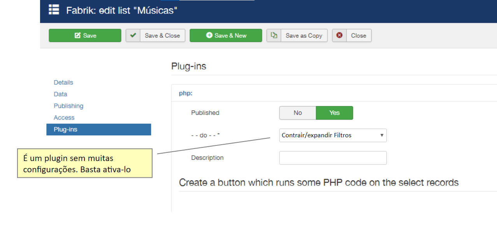

# Collapse / Expand Filters

Collapse/Expand Filters is a Javascript based list plugin, its use should only be for filters configured on the left side of the list. In the default configuration of joomla, all filters appear expanded in the column on the left side, so if there are several filters it is necessary to move the scroll bar down to use any of the filters that are at the end of the list.
The plugin's proposal is to transform the filters into "Collapse" elements that appear collapsed and can be expanded by the user, thus maintaining a more organized layout.

Expanded filters in default configuration:

 

 

Collapsed filters: (By clicking on the arrow it is possible to expand the filter)

   

 

### Specifications

The Plugin does not require many configurations, for it to work just activate it:

   

