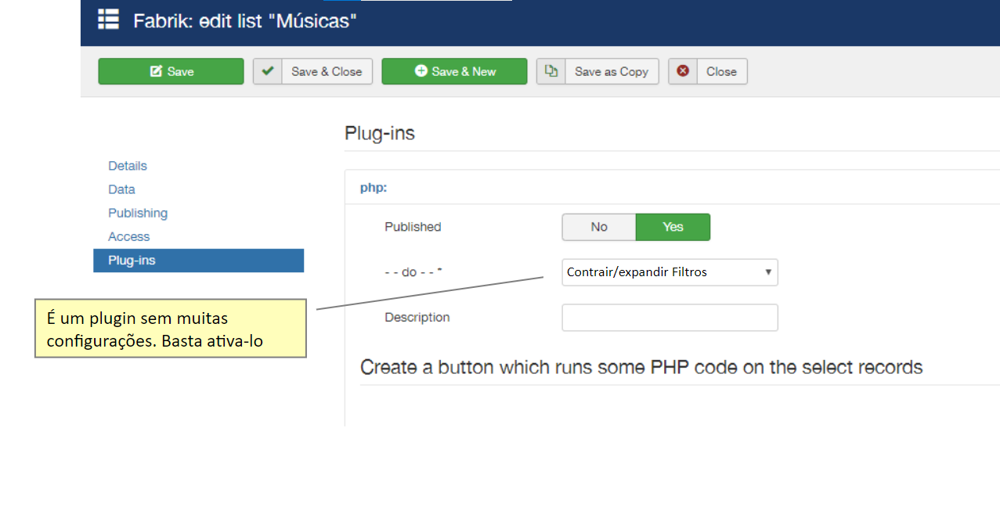

# Contrair / Expandir Filtros

  

## Sobre
Contrair/Expandir Filtros é um plugin de lista baseado em Javascript, seu uso deve ser apenas para filtros configurados no lado esquerdo da lista. Na configuração padrão do joomla, todos os filtros aparecem expandidos na coluna do lado esquerdo, sendo assim caso existam vários filtros é necessário mover a barra de scroll para baixo para utilizar algum dos filtros que estejam ao final da lista.
A proposta do plugin é transformar os filtros em elementos do tipo "Collapse" que aparecem contraídos e podem ser expandidos pelo usuário, mantendo assim um layout mais organizado.

 

Filtros expandidos na configuração padrão:

  

 

Filtros contraídos: (Ao clicar na seta é possível expandir o filtro)

  

 

## Especificações

O Plugin não exige muitas configurações, para seu funcionamento basta ativá-lo:

  

